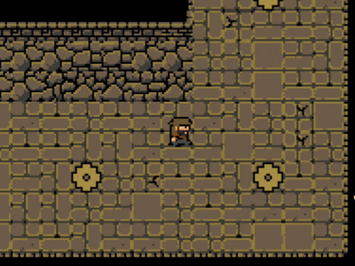
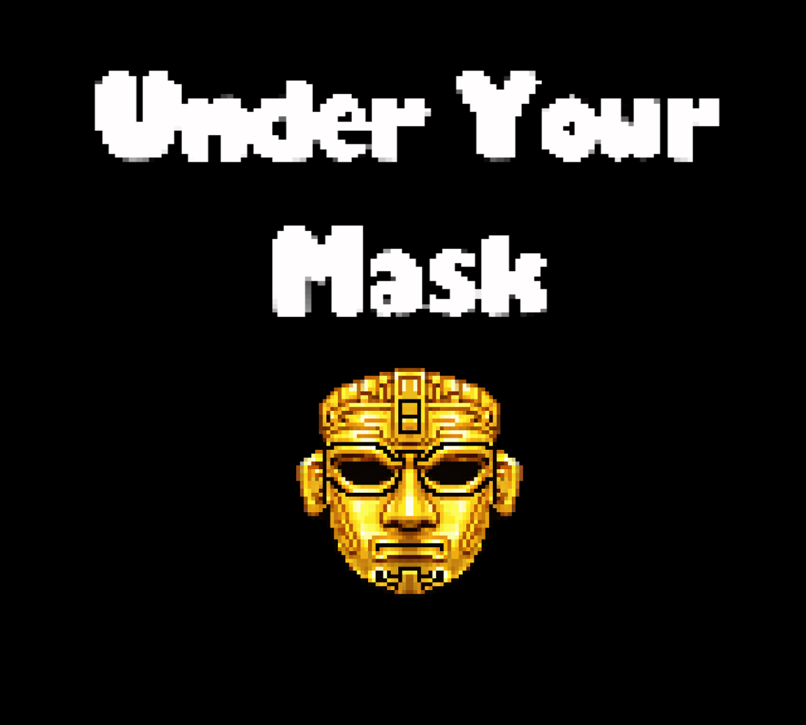

# 🎭 Under Your Mask

  
  

  
  

## 📖 Contexto del Proyecto

**Under Your Mask** es un puzzle-platformer 2D en pixel art desarrollado completamente en **48 horas** como mi primera participación en la **Global Game Jam 2026**. 

El juego explora una narrativa oscura sobre la identidad, la confianza y el precio de la libertad, combinando mecánicas de plataformas ágiles, resolución de puzzles en el entorno y un combate de jefe final desafiante con sincronización rítmica.

## 🛠️ Sistemas e Ingeniería (Bajo el capó)

Como desarrollador, enfoqué este proyecto en construir sistemas lógicos robustos y escalables dentro de Godot:

* **Sistema de Diálogos Dinámico (JSON):** Arquitectura de diálogos modular separada del código principal, permitiendo fácil inyección de guiones, control de velocidad de escritura tipo "typewriter" y modulación de pitch de audio aleatoria para las "voces".
* **Máquina de Estados de Jefe Final:** Lógica de combate estructurada en fases progresivas dependientes del HP. Implementación de ataques predecibles pero rítmicos que evitan la selección aleatoria pura para garantizar un patrón de baile ("baile mortal") justo para el jugador.
* **Sincronización Animación-Código (Freeze-Frame):** Sistema de impacto matemático donde la velocidad de reproducción de los `AnimationPlayers` se escala de forma dinámica (`velocidad_playback = duracion_base / duracion_ataque`), combinado con micro-pausas (`await`) para generar sensación de "peso" (Game Feel) en los golpes finales.
* **Gestión de Escenas y Transiciones:** Uso intensivo de `CanvasLayer` y `Tweens` para fundidos, cinemáticas y cortinas de transición sin bloquear el hilo principal de físicas del motor.

## 🚀 Instalación y Ejecución Local

Si deseas probar el proyecto directamente en el motor:
1. Clona este repositorio: `git clone https://github.com/Zer0LoL/under-your-mask.git`
2. Abre **Godot Engine 4.x**.
3. Importa el archivo `project.godot`.
4. Pulsa F5 para ejecutar el juego.

---
*Desarrollado por [Alvaro Roldan](https://github.com/Zer0LoL)*